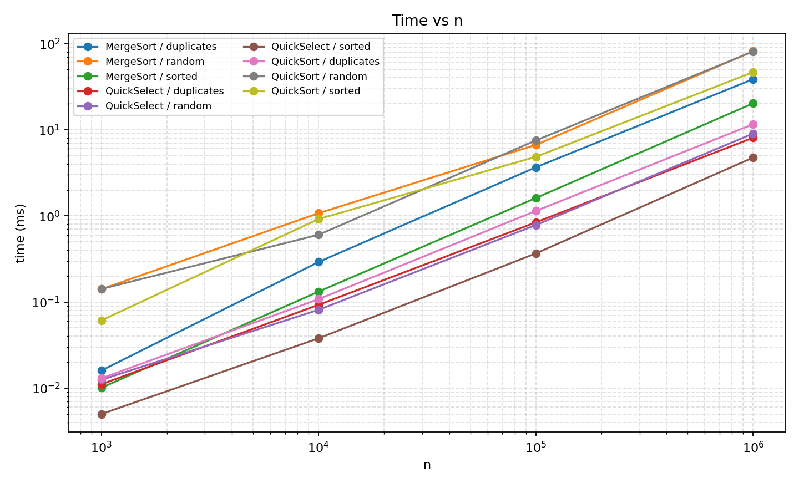
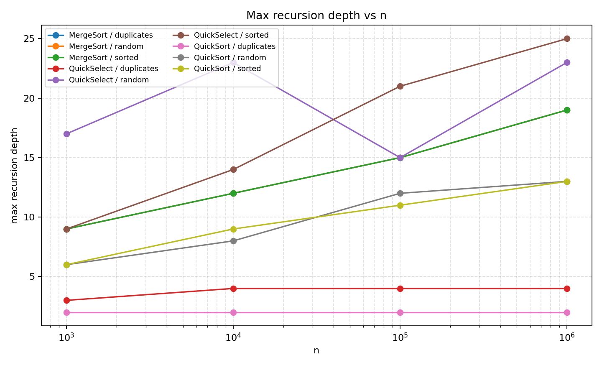
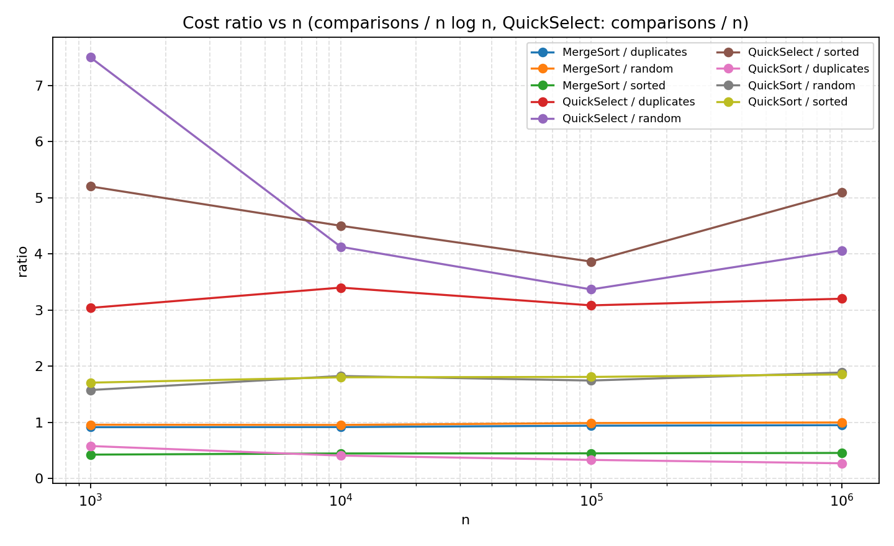

# Assignment 1 Report: Divide and Conquer & Asymptotic Notations

**Course:** Design and Analysis of Algorithms  
**Artifact:** MergeSort, QuickSort, QuickSelect with metrics, JUnit 5 tests, and CSV benchmarks  
**Environment:** OpenJDK 23 (bytecode target 17), Apple Silicon, Maven 3.9.9  
**Method:** sizes \(n \in \{10^3, 10^4, 10^5, 10^6\}\); inputs `random`, `sorted`, `duplicates` (values in \(\{0,\ldots,9\}\)); **median of 5 runs** per cell (wall time via `System.nanoTime()`).

This report matches the implementation in `src/main/java/daa/assignment1`. MergeSort allocates one `int[] helper` in the top-level call and cuts over to insertion sort at size \(\le 15\). QuickSort draws a uniform random pivot, partitions three ways, recurses into the **smaller** side, and iterates on the larger side. QuickSelect reuses the same partition and follows only the branch that contains index \(k\).

---

## 1. Asymptotic bounds

Notation: \(\Theta\) when the bound is tight for that case; \(O\) when only an upper bound is claimed. “Input” is the family that realises the case for **this** implementation (random pivot and 3-way partition matter).

| Algorithm | Best | Average | Worst |
|---|---|---|---|
| **Insertion sort** | \(\Theta(n)\) — already sorted: each inner loop does one comparison and stops | \(\Theta(n^2)\) — random order: \(\sim n^2/4\) inversions | \(\Theta(n^2)\) — reverse sorted: every insertion walks the whole prefix |
| **MergeSort** | \(\Theta(n\log n)\) — even on sorted data the tree still has \(\Theta(n)\) merge work per level | \(\Theta(n\log n)\) — the split is always mid; only the constant in the merge changes | \(\Theta(n\log n)\) — same recurrence for every permutation (cutoff only changes the base) |
| **QuickSort** (random pivot, 3-way) | \(\Theta(n)\) — all equal: one 3-way partition, both sides empty | \(\Theta(n\log n)\) — random pivot \(\Rightarrow\) balanced splits in expectation | \(O(n^2)\) — vanishingly rare unlucky pivot sequence; not the sorted array (pivot is random) |
| **QuickSelect** (random pivot, 3-way) | \(\Theta(n)\) — all equal and \(k\) lands in the equal band after one partition | \(\Theta(n)\) — expected linear: only one side is searched | \(O(n^2)\) — theoretically possible degenerate pivot streak; not typical on sorted input |

**Why sorted is not QuickSort’s worst case here.** A deterministic leftmost pivot would produce \(n-1, n-2, \ldots\) partitions on a sorted array (\(\Theta(n^2)\)). A uniform random pivot makes every rank equally likely, so the same array behaves like a random permutation of ranks.

**Why duplicates are fast.** Dijkstra’s 3-way partition puts every copy of the pivot in the middle band in linear time. An array drawn from \(\{0,\ldots,9\}\) collapses after a few partitions; measured QuickSort depth stays at **2** even for \(n=10^6\).

---

## 2. Recurrences and the Master Theorem

The Master Theorem for \(T(n)=a\,T(n/b)+f(n)\), \(n_{\log}= \log_b a\):

- Case 1: \(f(n)=O(n^{n_{\log}-\varepsilon})\) \(\Rightarrow\) \(T(n)=\Theta(n^{n_{\log}})\).
- Case 2: \(f(n)=\Theta(n^{n_{\log}}\log^k n)\) with \(k=0\) \(\Rightarrow\) \(T(n)=\Theta(n^{n_{\log}}\log n)\).
- Case 3: \(f(n)=\Omega(n^{n_{\log}+\varepsilon})\) and regularity \(\Rightarrow\) \(T(n)=\Theta(f(n))\).

### 2.1 MergeSort

Always split in half and merge in linear time (plus a \(\Theta(1)\) copy into the helper):

\[
T(n)=2T(n/2)+\Theta(n),\qquad n>15,\qquad T(n)=\Theta(n^2)\ \text{for }n\le 15\text{ (insertion)}.
\]

Here \(a=2\), \(b=2\), \(f(n)=\Theta(n)\), \(n_{\log}=1\). This is **Case 2** (\(k=0\)): \(T(n)=\Theta(n\log n)\). The cutoff changes only the constant and the exact tree height (\(\approx\log_2(n/15)\)), not the \(\Theta\) class for large \(n\).

### 2.2 QuickSort — balanced-split model

If every pivot is the median (or 3-way middle band is a constant fraction),

\[
T(n)=2T(n/2)+\Theta(n).
\]

Same parameters as MergeSort: **Case 2**, \(T(n)=\Theta(n\log n)\). The \(\Theta(n)\) term is the 3-way scan.

**Why a random pivot is \(O(n\log n)\) on average (not a Master-Theorem hypothesis).** The indicator that an element is compared to another is 1 iff one of them is chosen as pivot while both still share a subarray. For ranks \(i<j\) that probability is \(2/(j-i+1)\). Summing gives

\[
\mathbb{E}[T(n)]=\Theta(n)+2\sum_{1\le i<j\le n}\frac{2}{j-i+1}=\Theta(n\log n).
\]

Randomisation therefore puts **average** QuickSort in the same class as the balanced recurrence, even though a single unlucky path is still quadratic. Recursing into the smaller part first additionally caps **stack** depth by \(\lfloor\log_2 n\rfloor+O(1)\), independent of how unbalanced the large side is (that side is a loop, not a deeper call).

### 2.3 QuickSelect — balanced-split model

Only one recursive call, on a half-sized side in the idealisation:

\[
T(n)=T(n/2)+\Theta(n).
\]

Now \(a=1\), \(b=2\), \(f(n)=\Theta(n)\), \(n_{\log}=\log_2 1=0\). Then \(f(n)=\Omega(n^{0+\varepsilon})\) for e.g. \(\varepsilon=1\), and regularity holds (\(af(n/b)=\frac12 f(n)\le cf(n)\) for \(c<1\)). This is **Case 3**: \(T(n)=\Theta(n)\). That is a **different** Master-Theorem case from the two sorts (work at the root dominates, so the solution follows \(f(n)\), not \(n\log n\)).

The true randomised expectation is also \(\Theta(n)\), with a larger constant (\(\approx 3.39\,n\) comparisons for Hoare’s FIND in the two-way model; 3-way plus duplicates shrinks it).

---

## 3. Measured results

Full table: [`results.csv`](results.csv). Plots below use one line per `(algorithm, input)`.

### 3.1 Time vs \(n\)

Wall-clock time grows smoothly on a log–log plot. At \(n=10^6\):

| Algorithm | random | sorted | duplicates |
|---|---:|---:|---:|
| MergeSort | 81.5 ms | 20.3 ms | 38.7 ms |
| QuickSort | 81.2 ms | 46.7 ms | 11.6 ms |
| QuickSelect | 9.1 ms | 4.8 ms | 8.1 ms |

QuickSelect is about an order of magnitude faster than the sorts at \(n=10^6\), matching \(\Theta(n)\) vs \(\Theta(n\log n)\). QuickSort on `duplicates` is the fastest sort (11.6 ms): 3-way partition turns “many equals” into a **best** case, not a quadratic one. MergeSort is fastest on `sorted` because the merge always takes the left run (`helper[left] <= helper[right]`) and never copies from the right half until the left is exhausted — still \(\Theta(n\log n)\) comparisons, but a very prefetch-friendly pattern.

### 3.2 Max recursion depth vs \(n\)

| Algorithm | Pattern |
|---|---|
| MergeSort | Depth \(9,12,15,19\) for \(n=10^3\ldots10^6\). This is \(\approx\log_2 n\) (the insertion cutoff trims a few frames). Independent of input, as expected from a midpoint split. |
| QuickSort | Random/sorted: depth \(6\)–\(13\), well under \(2\log_2 n\) (\(2\log_2 10^6\approx 39.9\)). Duplicates: **depth 2** — one partition plus a trivial frame. |
| QuickSelect | Depth is the length of the **single** search path. Random/sorted: teens to mid-20s (not a complete tree). Duplicates: 3–4. |

The assignment test (QuickSort, sorted, \(n=10^5\)) requires `maxDepth <= 2 log2(n) ≈ 33.2`. The measured median depth for that family at \(n=10^5\) is **11**.

### 3.3 Ratio vs \(n\) (the \(\Theta\) check)

Define

\[
\rho_{\mathrm{sort}}(n)=\frac{\text{comparisons}}{n\log_2 n},\qquad
\rho_{\mathrm{select}}(n)=\frac{\text{comparisons}}{n}.
\]

If \(f(n)=\Theta(g(n))\), \(\rho(n)\) must approach a **positive constant band**.

**MergeSort / random** (closest to the textbook merge tree):

| \(n\) | comparisons | \(\rho=C/(n\log_2 n)\) |
|---:|---:|---:|
| \(10^3\) | 9 545 | 0.96 |
| \(10^4\) | 126 796 | 0.95 |
| \(10^5\) | 1 639 696 | 0.99 |
| \(10^6\) | 19 885 373 | 1.00 |

The ratio sits in \([0.95, 1.00]\) for all measured \(n\ge 10^3\). A concrete \(\Theta\) witness for \(g(n)=n\log_2 n\) on this curve is

\[
c_1=0.9,\quad c_2=1.1,\quad n_0=10^3:
\quad 0.9\,n\log_2 n \le C(n) \le 1.1\,n\log_2 n.
\]

MergeSort / sorted has a **lower** plateau (\(\rho\approx 0.42\)–\(0.46\)) because the merge almost never loses the `<=` test; it is still \(\Theta(n\log n)\), just a smaller \(c\).

**QuickSort / random:** \(\rho\approx 1.57, 1.83, 1.75, 1.89\). The band is wider than MergeSort’s (pivot quality jitter) but does not grow with \(n\), so it is consistent with \(\Theta(n\log n)\), e.g. \(c_1=1.4\), \(c_2=2.1\), \(n_0=10^3\).

**QuickSort / duplicates:** \(\rho\approx 0.27\) and **falling slightly** toward a linear regime: comparisons \(\approx 5.4n\) at \(n=10^6\), i.e. \(\Theta(n)\), which is the **best-case** row of the table, not \(\Theta(n\log n)\). Plotting against \(n\log n\) therefore **underestimates** the true tight bound; the right \(g(n)\) for that family is \(n\).

**QuickSelect:** \(\rho=C/n\) at \(n=10^6\) is \(\approx 4.06\) (random), \(5.10\) (sorted), \(3.20\) (duplicates). Values stay \(\Theta(1)\) (range roughly \(3\)–\(8\) across sizes), so \(c_1=2\), \(c_2=8\), \(n_0=10^3\) is a honest (slightly loose) \(\Theta(n)\) envelope. The ratio is noisier than MergeSort’s because each run follows one random path.

---

## 4. Theory vs practice

The **comparison counts** line up with the recurrences: MergeSort is rock-stable \(\Theta(n\log n)\); randomised QuickSort is the same class on random and sorted data; 3-way QuickSort on a 10-value alphabet is essentially linear; QuickSelect’s comparisons stay linear with a single-digit constant. Recursion depth matches the smaller-first / midpoint-split analysis and never approaches the \(2\log_2 n\) ceiling we test for.

**Wall-clock time** is a noisier proxy for \(T(n)\). Several JVM and hardware effects show up in `time_ms` but not in `comparisons`:

1. **Warm-up.** The first invocations compile bytecode to native code (C2). Taking the **median of 5** discards the slowest compile-heavy samples; remaining times can still include a mixed interpreter/JIT run at \(n=10^3\), which is why tiny sizes look “too slow” relative to \(n\log n\).
2. **GC.** MergeSort’s single helper is allocated once per call (`new int[n]`), so each trial can trigger allocation and occasional collections. That cost is \(\Theta(n)\) extra work, visible as a constant additive term, not a change of exponent. We never allocate helpers **inside** recursive calls, which is why MergeSort does not collapse into GC thrash at \(n=10^6\).
3. **CPU cache.** Sorted MergeSort and duplicate QuickSort stream sequentially and sit in L1/L2; random 32-bit keys during partition jump around and miss more. That is why sorted MergeSort (20 ms) beats random MergeSort (82 ms) at the same \(\Theta(n\log n)\) comparison count.
4. **Cutoff.** Insertion sort on \(n\le 15\) removes many tiny recursive frames and uses a tight loop the JIT inlines. It **increases** comparisons on reverse-sorted leaves (\(\Theta(m^2)\) for \(m\le 15\)) but **decreases** time. Depth plots sit a few units below \(\log_2 n\) for that reason.
5. **Timer granularity.** Sub-millisecond medians at \(n=10^3\) are close to `nanoTime` and OS-noise floors; ratios and comparison counts are the reliable \(\Theta\) evidence, not the smallest `time_ms` cells.

**Bottom line.** On this machine the algorithms do what the Master Theorem predicts: MergeSort and typical QuickSort track \(n\log n\), QuickSelect tracks \(n\), and the engineering choices (one buffer, cutoff, random pivot, 3-way partition, smaller-first recursion) show up as better constants and bounded depth rather than as a different asymptotic class.

---

## 5. Implementation notes (for the defence)

- `Metrics` is a **per-call object** (`comparisons`, `currentDepth` / `maxDepth`, `nanoTime` interval). Tests assert that a second instance stays at zero.
- `Partition.threeWay` is shared by QuickSort and QuickSelect; QuickSelect never sorts the ignored side.
- Invalid QuickSelect inputs throw `IllegalArgumentException` (`null`, empty, `k` out of range) with an explicit message.
- Reproduce: `mvn test`, then `java -cp target/classes daa.assignment1.benchmark.Benchmark`, then `python3 generate_plots.py`.
